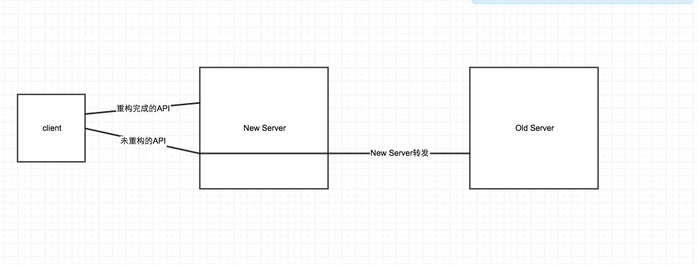

# CRM重构白皮书

### 前世今生

不知不觉中CRM系统已经快要1岁了。在这几个月的时间里，整个团队完成了从0到1，从1到N的过程，这是值得肯定的地方。

但是，正如同中国的经济一样，在经历过高速的发展期后，必然需要停顿那么一下，来进行产业结构的调整，我们的系统也是一样的。目前系统的扩展性跟可维护性都已经亮起了红灯，下面是一些主要矛盾。

* 需求管理方面
	*  首先，对于需求的讨论不够。合理的需求实现了，不合理的需求也实现了。
	*  第二，某些需求实现的方法不正确。使用方提供的需求，是非常感性的。我们需要对这些需求进行抽象与归纳，然后才是具体的实现，这一步是缺失的。
	*  第三，需求无文档。这直接导致无法进行系统的分析。

* 技术方面
	* __系统结构设计不合理，充分的展现了低内聚，高耦合的特点。__
		* 低内聚表现为：
			* clue的create操作，散落在每一个业务逻辑中，当需要添加默认数值的时候，需要在整个项目中寻找所有的sql操作，进行修改。
			* 由于缺乏统一的设计跟管理，系统的中存在大量的功能相同的代码等等
		* 高耦合表现为：
			* 前端页面展示层，依赖后端的api。
	* __采用技术老旧。__（比如：使用的bodyParser无法自动完成反序列化。这种公共的东西还需要出现在业务代码当中）
	* __api设计混乱。__ （比如：clue的put操作，出现了各种不同的api。前端还需要给每个api传递不同格式的参数）
	* __权限系统接近崩溃。__ 原有的权限的设计依然不能满足现有的也无需求，产品不停地在上面打洞，导致数据安全性基本为0.

综上所述，我认为应该从权限系统下手。首先，设计一个扩展高的权限模型。然后，逐步将现有的需求塞入设计好的权限模型当中。

### 逐步迁移方案

### 权限模型

* __对于权限，引入组的概念__
	* __系统自动生成组__：创建用户的同时创建该用户的组，这个组里有这个用户跟他在行政体系中的上级。这样我们称这个用户跟他的领导加入了这个用户的组。也意味着，这个用户跟他的领导拥有了这个组。
	* __手动创建组__：有管理员创建组，并把指定用户放入到组内。例如：管理员创建新中关组，并把新中关的员工添加到该组中。
* __数据修改__: 给每个数据表增加r,w两列。
	* r：拥有这条数据读权限的组id
	* w：拥有这条数据写权限的组id
* __访问控制__：
	* 首先获得当前用户拥有的所有组，我们称为集合A。
	* 待访问的数据的r，称为集合R。
	* 待访问的数据的w，称为集合W。
	* 只能读取 A ∩ R != Ø 的数据。
	* 只能修改 A ∩ W != Ø 的数据。
* __读写组的修改(先按照数据表的角度归纳)：__
	* 暂时方案：
		* 将r，w看做栈
		* 每次从栈顶pop第一个元素出来
		* 将当前责任人所在的组压栈
		* 例外：
			* 跨机构操作的时候，r不用pop
		* 数据生成r，w默认值
			* 合同r：[财务组id,-1]
			* 定金，收款，退款r，w：[财务组id,-1]
			* 其他默认为空数组

### 系统设计

__名词解释：__  

* Entrance是系统的对外窗口，与系统打交道必须经过Entrance。包括以下几类：
	* API
	* 接入系统的消息队列
	* 自定义的系统脚本
* —> 表示调用关系。比如，Entrance可以调用的Service。

__说明：__  

* __增加中间的业务层__
	* 造成__原有系统__混乱的原因有很多，其中一个很重要的原因就是系统层次过于粗狂
	* __原系统__从理论上只有Entrance和Model两层
	* 业务逻辑在Entrance中处理
	* 不同的Entrance存在着相似的业务逻辑（比如工单和商机），这也就产生了相似的代码写两遍的问题
	* 综上所述，本次系统增加了中间层次。目的在于对日益复杂的业务逻辑进行封装，将原来分散的业务逻辑通过Entity整合集合在一起
* __根据业务复杂程度选择合适的路径实现业务逻辑__
	*  __Entrance -> Model__ 对于非常简单的业务，可以直接在入口处搞定
	*  __Entrance -> Entity -> Model__ 出现复杂的业务逻辑后，需要将分散在各个Entrance的业务逻辑重构到到Entity对象中

* __Entity Coding Specification__

	* __ 开头的属性或者函数表示private，只有对象自己可以调用
	* _ 开头的属性或者函数表示protected，只有对象或者子类可以调用

### 重构第一阶段：CLUE

#### 重构范围
第一阶段重构准备拿商机，工单，线上工单，藏经阁，公池工单下手。  

理由如下：

* 重构的server还没有上线的时候限制较少，所以选择在这个时间段将最复杂的内容搞定
* 用最复杂的部分检验重构方案，即使不行推倒重来的成本也不大

#### Clue Entity Design

由于这4部分公用一个数据表，存在大量的相似业务，所以打算用OO的设计思路来实现，类关系见下图：

